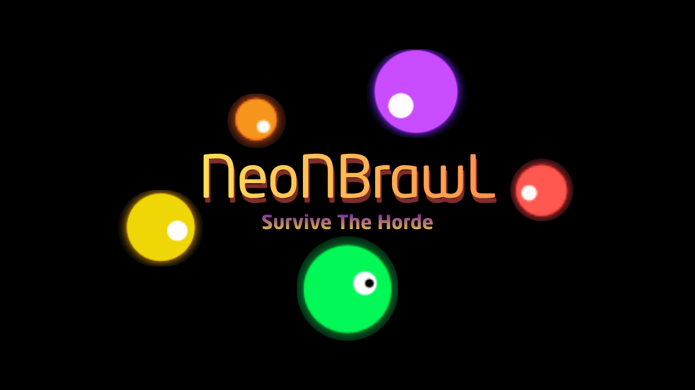

<div align="center">
  

  # ⚡ NeoNBrawL - Official Website
  
  **Sobrevive a la horda en la arena retro-futurista definitiva.**
  
  [](https://cucupg.itch.io/neonbrawl)
  [](https://github.com/CurroPG)
  [](#)

</div>

<br>

El portal web oficial de **NeoNBrawL**, un videojuego indie tipo supervivencia táctica en cámara cenital (arena-survival). Esta web ha sido desarrollada desde cero utilizando tecnologías web estándar sin frameworks, con una estética completamente "neon-noir" cyberpunk.

---

## 🎮 Sobre el Juego

El objetivo es sencillo: sobrevivir el máximo tiempo posible contra oleadas continuas que el juego lanza hacia ti en un mapa modular infinito. El proyecto nació de una práctica académica y fue creciendo progresivamente.

**Dominio Táctico Neón (Características Principales):**
- ☣️ **6 Tipos de Enemigos:** Diferentes IAs y patrones a los que adaptarse.
- 🧬 **Progresión Permanente:** Mejoras inter-rondas (power-ups) para poder hacer frente a la horda.
- 🌐 **Leaderboard Global:** Compuertas abiertas para la competición mundial.
- 📱 **Soporte Móvil:** Controles optimizados y adaptados para dispositivos móviles.
- 🗺️ **Mapa Infinito:** Generación de arenas continuas.

## 📖 Historia de Origen

> *"Todo empezó como un proyecto de la asignatura de Programación. El proyecto consistía en una pequeña simulación en la terminal del IDE que podéis ver en mi antiguo repositorio: [SurvivalGameJava](https://github.com/CurroPG/SurvivalGameJava).*
> 
> *Cuando pasó el tiempo de entrega de este proyecto, el profesor nos dejó explorar y expandir dicho proyecto usando IA. Por lo que a mí se me ocurrió hacer este juego indie basado en la supervivencia con power ups y oleadas. Actualmente, sigo desarrollando el juego para implementar nuevos cambios."* — **Curro**

## 💻 Aspectos Técnicos de la Web

La página web actual contenida en este repositorio se contruyó bajo los mismos ideales de rendimiento y solidez que el propio juego:

- **Frontend:** HTML5 semántico.
- **Estilos:** CSS3 puro con un intenso uso de variables CSS (`--neon-green`, `--neon-purple`) para generar uniformidad visual y efectos de "glow" (glassmorphism dinámico).
- **Interactividad:** Vanilla JavaScript. Se han diseñado observadores de intersección (Intersection Observer) para fundidos de scroll fluidos, manipulaciones de botones simulando "terminales hackeadas" (DOM) y avisos temporizados (`alert()` interactivo).
- **Despliegue Cero-Dependencias:** Pensado para subir el repo base directamente a **Vercel** o **GitHub Pages** al no requerir ningún _build-step_ (ni Node, ni Vite, ni Webpack).

### 📁 Estructura del proyecto

```text
/
├── assets/          # Imágenes y vídeos (logos, capturas de pantalla, foto perfil, gameplays)
├── css/             # Archivos de estilos globales
│   └── styles.css
├── js/              # Funciones interactivas (easter-eggs y animaciones)
│   └── main.js
├── index.html       # Landing page (Hero, Características, Sección Arena)
├── about.html       # Portfolio interactivo del Creador (Sobre Mí)
└── blog.html        # Bitácora del desarrollo de NeoNBrawL
```

## 👨‍💻 Sobre el Desarrollador

**Curro Portillo Guerrero**
Soy estudiante de primer curso de DAM (Desarrollo de Aplicaciones Multiplataforma) en Antequera. Apasionado por aprender a resolver problemas escribiendo código eficiente (¡e intentando no morir a manos de las IAs de mis propios enemigos virtuales en el proceso!).

- 💼 [LinkedIn](https://www.linkedin.com/in/curro-portillo-guerrero-075600390/)
- 🐙 [GitHub](https://github.com/CurroPG)
- 🌐 [Portfolio Personal](https://mi-portfolio-tau-two.vercel.app/)

## 🚀 Despliegue

Para probar la página web en tu propio entorno:
1. Clona el repositorio `git clone https://github.com/CurroPG/WebJuego.git`
2. Abre cualquiera de los ficheros `.html` con tu navegador (doble click) o a través de Live Server (VS Code).
3. Todo estará funcionando automáticamente gracias a las rutas relativas.
